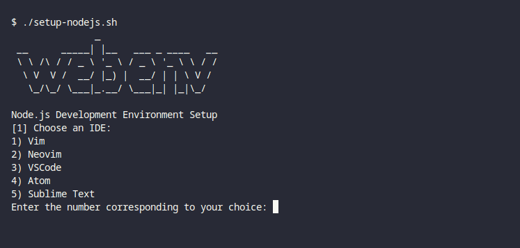

# webenv
Setup your web development environment in one command

## overview
Setting up a development environment on your new machine can be hard sometimes. The sole aim of this project is to provide a convenient way of getting the job done with one command.



## usage
Below are the environments currently available;

- [Node.js](./setup-nodejs.bash) : 
  Run this script to setup an envirnoment with an IDE, git, browser, node.js, package manager and your favorite framework cli
  ```sh
  curl -O https://raw.githubusercontent.com/henryhale/webenv/master/setup-nodejs.bash
  bash setup-nodejs.bash
  ```

- [LAMP stack](./setup-lamp.bash) : 
  Setup a PHP based enviroment with php, composer, database server and phpmyadmin
  ```sh
  curl -O https://raw.githubusercontent.com/henryhale/webenv/master/setup-lamp.bash
  bash setup-lamp.bash
  ```

- [XAMPP](./setup-xampp.bash) : 
  Setup a pre-configured PHP based enviroment with XAMPP from Apache Friends containing php, mysql, mariadb, perl, apache, ftp server, phpmyadmin
  ```sh
  curl -O https://raw.githubusercontent.com/henryhale/webenv/master/setup-xampp.bash
  bash setup-xampp.bash
  ```

## faq
- Errors concerning user permissions: re-run the command with sudo.
  Example:
  ```sh
  $ chmod +x setup-nodejs.bash
  $ sudo ./setup-nodejs.bash
  ```

## development
Clone this GitHub repository and get hacking.
While testing out new features or implementing adjustments, run the `setup-*` scripts with `--local` command line argument.
This enables you to use the local files rather than downloading the common variables and functions from the GitHub repo.
```sh
$ ./setup-nodejs.bash --local
```

## issues
In case of any issues such as bugs or errors, kindly [open an issue](https://github.com/henryhale/webenv/issues) describing what happened

## license

Released under [MIT License](./LICENSE.md)

Copyright 2023 - Present [Henry Hale](https://github.com/henryhale)
